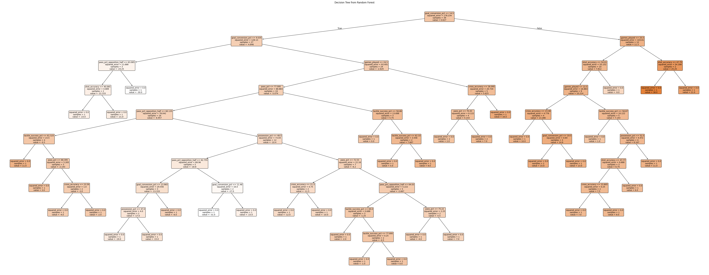
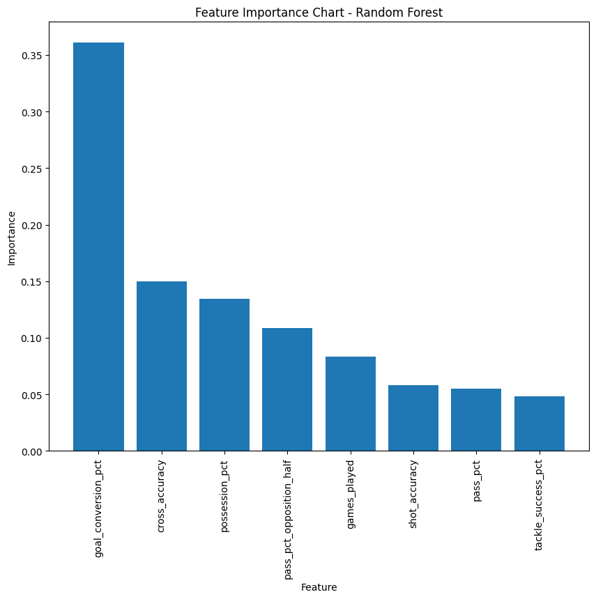
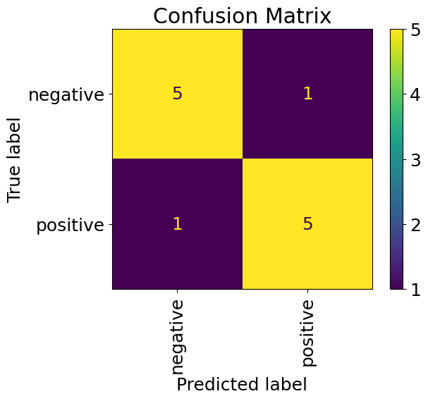

# Machine Learning Final Project

[2024_ia651_Sheehe_Weaver](https://github.com/Clarkson-Applied-Data-Science/2024_ia651_Sheehe_Weaver)

[IA 651: Machine Learning](https://github.com/Clarkson-Applied-Data-Science)

Instructor: Professor Michael Gilbert

Final Project

Kelsey Sheehe & Sarah Weaver

## Table of Contents

1. [Project Overview](#project-overview)

    1.1 [Importance](#importance)

    1.2 [Process](#process)
    
2. [Dataset Link & Data Overview](#dataset-link--data-overview)
3. [Exploratory Data Analysis](#exploratory-data-analysis)

    3.1 [Scaling the Data](#scaling-the-data)

4. [Linear Regression](#linear-regression)
5. [SVR](#svr)
6. [Decision Tree Regressor](#decision-tree-regressor)
7. [Principal Component Analysis](#principal-component-analysis)

    7.1 [Linear Regression - PCA](#linear-regression---pca)

    7.2 [SVR - PCA](#srv---pca)

8. [Binned Data](#binned-data)

    8.1 [Logistic Regression](#logistic-regression)

    8.2 [SVC](#svc)

9. [Conclusions](#conclusions)

    9.1 [Project Limitations](#project-limitations)

## Project Overview

All code for this project is in the repository titled "IA651_Project_Code.ipynb"

### Importance

The goal for this project is to create a formula to predict a team's goal_differential (goals - goals_conceded) using the selected [dataset](#dataset-link--data-overview). Predicting a team's goal differential can be key for being able to rank teams and make predictions on team's success in the post season. Being able to out-score opponents is largely impactful towards winning games and being a well ranked team. 

### Process

To tackle this project our team used a variety of machine learning techniques learned though out this course. To start we evaluated and examined out selected data. Multiple figures were created to better understand each variable and their relationship with others. The Exploratory Data Analysis was key in determining what processes we should try on our data. 

The first method implemented was Linear Regression which yielded relatively good training and resting MSE and a good test R Squared value.

Support Vector Regression (SVR) was chosen next and a grid search was performed to find the optimal values for parameters gamma and C. This was done without a pipeline and with a pipeline, where the pipeline had a minimal effect of the success of the model.

Next, a Decision Tree Regressor was fit on the model and the optimal max depth was found. A similar process was used for a Random Forest Regressor where the importance of different features in the model was found.

For most of the models fit on our dataset, relatively poor R Squared and MSE values were calculated. This can be attributed partially to the limited size of the dataset, with only 59 observations.

To try and remedy this, and given high correlation for some of the features that was noticed in the EDA, we opted to perform Principal Component Analysis (PCA) to attempt to reduce the number of features see if there would be any improvement in the MSE or R Squared Value in the Linear Regression or SVR. This showed some success in improving both the R Squared values and MSE values. 

To try even more modeling techniques in this project, we also wanted to be able to treat this data as categorical and be able to fit more models. We categorized goal_differential into two bins, a positive goal_differential and a negative goal_differential. With this categorical response variable, SVC and Logistic Regression were used. These results were promising and new metrics were evaluated including a confusion matrix.

[Go To Top](#machine-learning-final-project)

## Dataset Link & Data Overview

Link to dataset: [National Women’s Soccer League Team Statistics](https://data.scorenetwork.org/soccer/nwsl-team-stats.html#data)

The data for this project has been sourced from the [Score Sports Data Repository](https://data.scorenetwork.org/) and focuses on data collected from 2016 to 2022 (excluding 2020 due to cancellation of season because of COVID) on each NWSL team during their regular season. [NWSL](https://www.nwslsoccer.com/) is the National Women's Soccer League in the United States, founded in 2012, and currently hosts 14 different teams. 

This dataset originally has 13 columns and 59 rows before modifications. There are no null or missing values.

The dataset utilized has the following parameters:

|Variable |Description|
|---------|-----------|
|team_name | Name of NWSL team|
|season | Regular season year of team's statistic|
|games_played | Number of games team played in season|
|goal_differential | Goals scored - goals conceded|
|goals | Number of goals scores|
|goals_conceded | Number of goals conceded|
|cross_accuracy | Percent of crosses that were successful|
|goal_conversion_pct | Percent of shots scored|
|pass_pct | Pass accuracy|
|pass_pct_opposition_half | Pass accuracy in opposition half|
|possession_pct | Percentage of overall ball possession the team had during the season|
|shot_accuracy | Percentage of shots on target|
|tackle_success_pct | Percent of successful tackles|

Note: Because goal_differential is equal to goals - goals_conceded, we will remove the goals and goals_conceded columns from our dataset.

Below is a sample of this dataset without any modifications:

|Team Name |season |games_played |goal_differential |goals |goals_conceded |cross_accuracy |goal_conversion_pct |pass_pct |pass_pct_opposition_half |possession_pct |shot_accuracy |tackle_success_pct| 
|---------|-----------|---------|-----------|---------|-----------|---------|-----------|---------|-----------|---------|-----------|---------|
|Boston Breakers |2016 |20 |-33 |14 |47 |25.57 |8.97 |67.38 |57.86 |47 |42.95 |77.42 |
|Boston Breakers |2017 |24 |-11 |24 |35 |23.70 |12.37 |72.53 |61.42 |48 |42.78 |73.49 |
|Chicago Red Stars |2016 |21 |3 |25 |22 |21.19 |11.79 |67.35 |57.74 |36 |48.58 |84.32 |
|Chicago Red Stars |2017 |25 |2 |33 |31 |21.08 |13.10 |69.23 |61.52 |47 |49.60 |71.29 |
|Chicago Red Stars |2018 |25 |8 |38 |30 |25.96 |13.67 |71.63 |64.55 |51 |45.68 |67.97 |

[Go To Top](#machine-learning-final-project)

## Exploratory Data Analysis

Before performing any of our machine learning modeling techniques to the data set we wanted to investigate the data further. A variety of correlation images, scatter plots, histograms and other images were created to get an appropriate understanding of the data and features in for our project.

The .describe method was used to get summary statistics of the numeric values in the data set and are shown in the table below:

|    |games_played |goal_differential |goals |goals_conceded |cross_accuracy |goal_conversion_pct |pass_pct |pass_pct_opposition_half |possession_pct |shot_accuracy |tackle_success_pct| 
|----|-------------|------------------|------|---------------|---------------|--------------------|---------|-------------------------|---------------|--------------|------------------|
|count |59.000000 |59.000000 |59.000000 |59.000000 |59.000000 |59.000000 |59.000000 |59.000000 |59.000000 |59.000000 |59.000000 |
|mean |23.593220 |0.491525 |31.254237 |30.762712 |23.829153 |12.804407 |73.234068 |63.746271 |50.033898 |46.563220 |67.517627 |
|std |1.772575 |15.054353 |10.411521 |8.173420 |2.720766 |3.000926 |3.450056 |3.976299 |3.162093 |3.988194 |8.643450 |
|min |20.000000 |-33.000000 |12.000000 |17.000000 |18.420000 |5.430000 |62.600000 |53.710000 |41.000000 |35.190000 |56.870000 |
|max |27.000000 |41.000000 |62.000000 |52.000000 |33.160000 |20.000000 |79.990000 |72.140000 |58.000000 |54.020000 |86.340000 |

Histograms of each column were made to see the normality of each feature and if there are any points of concern before moving on to modeling. Overall, the histograms looked good and showed no evidence of extreme outliers and relatively normal looking distributions for most features. Some of these histograms are shown below:

A correlation matrix of the features of interest and the response variable was made:

The correlation matrix above shows that is a strong correlation between pass_pct_opposition_half and pass_pct, possession_pct and pass_pct, and shot_accuracy and goal_conversion_pct.

A pair plot was created as well to look at correlation and the relationship between the data as shown below:

Showing similar findings as the other correlation matrix, as expected.

### Scaling the Data

For all models, a train test split of 80:20 was used before the data was scaled.

After removing team_name, season, goals, and goals_conceded from the dataset the following were chosen for the X and y variables:

|Variable Classification |Feature Name|
|---------|-----------|
|X |games_played |
|y |goal_differential |
|X |cross_accuracy |
|X |goal_conversion_pct |
|X |pass_pct |
|X |pass_pct_opposition_half |
|X |possession_pct |
|X |shot_accuracy |
|X |tackle_success_pct |

A standard scalar was used to scale the data in the X data frame for each column to have a mean of one (after the train test split).

[Go To Top](#machine-learning-final-project)

## Linear Regression

Linear regression model was implemented on the scaled X and the y data mentioned above. 

The following table is a portion of the OLS Regression Results table: 

|-----|coef |std err |t |P value |
|-----|--------|------|----------|----|
|constant |-174.1129 |57.416 |-3.032 |0.004 |
|games_played |2.6139 |0.890 |2.937 |0.005 |
|cross_accuracy |1.8134 |0.501 |3.619 |0.001 |
|goal_conversion_pct |2.4278 |0.569 |4.266 |0.000 |
|pass_pct |-0.8835 |0.952 |-0.928 |0.358 |
|pass_pct_opposition_half |0.3619 |0.702 |0.515 |0.609 |
|possession_pct |1.7816 |1.7816 |2.927 |0.005 |
|shot_accuracy |-0.1419 |0.456 |-0.311 |0.757 |
|tackle_success_pct |-0.0336 |0.214 |-0.157 |0.876 |

The factors with a P value less than 0.05 and that can be deemed statistically significant for this model are: const, games_played, cross_accuracy, goal_conversion_pct, and possession_pct. 

And the overall MSE and R Squared for this model are shown below:

|Train/Test |MSE |R² |
|-----------|----|---|
|Training |87.18987249386363 |0.53906985100382723 |
|Testing |78.94283999537852 |0.7770457379462508 |

The training and testing MSEs are close to each other and not too high, in addition to that the testing R Squared value is close to one and shown that this model is a good representation of the data.

[Go To Top](#machine-learning-final-project)

## SVR

Because Linear Regression yielded poor results Support Vector Regression (SVR) was used on the data set to try and create an improved model.

A grid search was implemented to obtain the optimal gamma and C values for SVR. The following specifications were used for the SVR's folds:

    fold = KFold(n_splits = 5, shuffle = True, random_state = 7)

And the following gamma and C values were tested:

    gamma = [1, 0.1, 0.01, 0.001, 0.0001]
    C = [0.1, 1, 10, 100, 1000, 10000, 20000]

This fit 5 folds for 35 candidates, totalling 175 fits. The results from the grid search are below:

    gamma = 0.1
    C = 10

With these optimal hyper parameters SVR was performed and the MSE and R Squared for this model were calculated and are shown below:

|Train/Test |MSE |R² |
|-----------|----|---|
|Training |54.37376168001874 |0.7125525550640378 |
|Testing |213.89481569990585 |0.39590771253875593 |

The training and testing MSE for this model performed worse than the Linear Regression. The MSEs have an even greater distance between each other. However, the MSE and R Squared values were much better after the grid search and using the optimal C and gamma parameters. The good training R Squared value and the poor testing R Squared value could be attributed to the limited amount of data in the testing data set because of the size of the original data set. 

A pipeline was tested out to try and obtain better results but the optimal gamma and C parameters that were chosen were the same as the SVR without the pipeline. However, because the pipeline effects the scalar the new MSE and R² are shown as the following:

|Train/Test |MSE |R² |
|-----------|----|---|
|Training |55.25228168331632 |0.7079082501185916 |
|Testing |346.5619419168241 |0.02122267173941028 |

These results are actually worse than the SVR performed without the pipeline, and are overall not very good.

[Go To Top](#machine-learning-final-project)

## Decision Tree Regressor

To try and improve the model for this project, a decision tree was used. A regressor model was chosen for this dataset because the data is not categorical. 

A similar grid search as was used for SVR was used for the decision tree regressor to find the optimal max depth. The following max depths were tested in the grid search:

    max_depth = [2, 3, 4, 5, 10, 50, 100]

This resulted in a optimal max_depth of 2. With this max depth found, the decision tree model was fit and the following figure was created showing the tree:

This decision tree allows us to see what features are used to make splits on and at what values. You can follow the tree down to get an understanding of what may predict certain goal_differentials.

[Go To Top](#machine-learning-final-project)

## Random Forest Regressor

After implementing the decision tree regressor a random forest regressor was fit on the model. For the random forest a grid search was used once again to find the optimal max depth and n_estimators. The following values were tested:

    max_depth = [2, 3, 4, 5, 10, 50, 100]
    n_estimators = [5, 10, 20, 100, 500, 1000]

The optimal parameters that the grid search found were:

    max_depth = 50
    n_estimators = 20

Creating a decision tree with the max depth of 50 resulted in the following tree:

With these optimal parameters used in the random forest regressor model the features could be ranked by importance to the model. The following graph illustrates each features importance:

This graph shows us that goal_conversion_pct dominates the other features in importance for this model.

[Go To Top](#machine-learning-final-project)

## Principal Component Analysis

Due to the relatively poor MSEs and R² values PCA was investigated to see if better results could be obtained after using principal components.

After performing PCA on the dataset and setting *n_components* equal to 0.9 (meaning we want the number of Principal Components that would describe at least 90% of the variance in the data). Our model calculated that the top 4 Principal Components explain 90.98% of the variance in our data, as illustrated below in the image.

A scree plot of these principal components can be shown below:

Below is a sample data frame using these 4 Principal Components (PCs):

|PC 1 |PC 2 |PC 3 |PC 4 |
|-----|-----|-----|-----|
|-3.299368 |0.018155 |-1.766622 |0.130626 |
|-1.065873 |-0.554368 |-0.079226 |0.044649 |
|-3.125800 |1.138610 |-0.690204 |-1.550228 |
|-1.187709 |0.103420 |1.240969 |-1.022356 |
|0.023972 |-0.000238 |0.591931 |1.025205 |
|... |... |... |... |

To better interpret this information, we created a single loading chart, as shown below for PC1 and PC2 (the two PCs that explain the largest amount of the variance):

From this chart, we can see that pass_pct and pass_pct_opposition_half contribute to the first principal component, and shot_accuracy and goal_conversion_pct contribute to the second.

To see if using PCA has an impact on the model, Linear Regression and SVR were re-preformed with the PCA data frame. 

### Linear Regression - PCA

Using this new dataset and applying linear regression we calculated the weight and intercept for these 4 PCs. The following table displays the calculated results:

|Feature |Slope |
|--------|------|
|PC 1 |3.075553762964335 |
|PC 2 |3.7619854415126275 |
|PC 3 |4.515514034026799 |
|PC 3 |4.965233943838386 |

Intercept = -0.15721666910229298

After performing linear regression on the 4 PCs that account for over 90% of the variance, each PCs slope, intercept, train MSE, and test MSE were calculated and shown in the table below, to validate and understand these results:

|Train/Test |MSE |R² |
|-----------|----|---|
|Training |106.29153344848993 |0.43808872581053204 |
|Testing |72.95560629326467 |0.793955178648869 |

These values were relatively good, but similar to the results that performing Linear Regression without the PCA data yielded. However, the advantage to using the PCA data is that you can use only 4 PCs instead of 8 features to get these results.

### SVR - PCA

Similar to re-preforming Linear Regression with the PCA data, the same process was done for SVR.

A grid search was performed with the following C and gamma values being tested:

    C = [0.1, 1, 10, 100, 1000, 10000, 20000]
    gamma = [1, 0.1, 0.01, 0.001, 0.0001]

This resulted in an optimal gamma and C value of:

    C = 20000
    gamma = 0.001

After performing SVR with these optimal parameters, the following training and testing MSE and R Squared values were calculated:

|Train/Test |MSE |R² |
|-----------|----|---|
|Training |111.06981553009075 |0.4128282889177838 |
|Testing |90.8089157683958 |0.7435329815315865 |

Similar to the results of performing Linear Regression with the PCA data, the SVR data showed improvement with the PCA data. The training and testing MSEs are closer to one another and the R Squared values have gotten closer to positive one. 

[Go To Top](#machine-learning-final-project)

## Binned Data

To try one final method we binned our response variable, goal_differential, into two categories, positive and negative.

    pd.cut(soccer_data["goal_differential"], bins = [-34, 0 ,45], labels = ["negative", "positive"])

### Logistic Regression

Now that we have a response variable that is categorical we fit a logistic regression on the scaled X data.

The training accuracy and F1 scores can be shown in the table below:

|Train/Test |Accuracy |F1 Score |
|-----------|----|---|
|Training |0.851063829787234 |0.8485964104924069 |
|Testing |0.8333333333333334 |0.8285714285714285 |

While the model is making a much simpler prediction (positive or negative goal_differential) these values in the table are relatively good and we continued with the binned data and fit SVC.

### SVC

The metrics for SVC are in the table below:

|Train/Test |Accuracy |F1 Score |
|-----------|----|---|
|Training |1.0 |1.0 |
|Testing |0.5 |0.4375 |

The training accuracy and F1 score for this model are very good, however the testing values are not as good. This could be attributed to the small size of the testing data.

Like with the un-binned data, we performed a grid search to find the optimal C and gamma parameters. The optimal values are:

    C = 1
    gamma = 0.1

The metrics for SVC with these new gamma and C parameters are in the table below:

|Train/Test |Accuracy |F1 Score |
|-----------|----|---|
|Training |0.9574468085106383 |0.9569597069597069 |
|Testing |0.8333333333333334 |0.8333333333333334 |

Using the optimal gamma and C parameters, the testing accuracy and F1 score improve a lot.

To finish our project we created a confusion matrix to see when the model is tested how many times it can predict if a team will have a positive or negative goal_differential. 

This confusion matrix shows that for both positive and negative labeling, the model predicts correctly 5 out of 6 times for an accuracy of 83.33%.

[Go To Top](#machine-learning-final-project)

## Conclusions

Overall, before the data was binned, Linear Regression and SVR preformed similar with or without the PCA data and in some cases Linear Regression was the ideal model to use. The advantage to PCA for this data set was that you could use only 4 of the 8 PCs to account for over 90% of the variation in the model. 

After binning the data and using Logistic Regression and SVC we would make more accurate predictions on if a team would have a positive or negative goal_differential. 

### Project Limitations

One of the greatest limitations of this project was the size of the data set. This data set only contained 59 observations. When performing operations like a train test split, this left very few observations in the testing data set, which can account for some of the large differences in training and testing MSE and the weak R Squared values.

If given more time and if it was more easily available, I think that it would have strengthened the project to find more data on the teams that this data set followed or find another similar dataset of a different soccer league and see how combining those observations would work for predicting goal_differential. 

[Go To Top](#machine-learning-final-project)